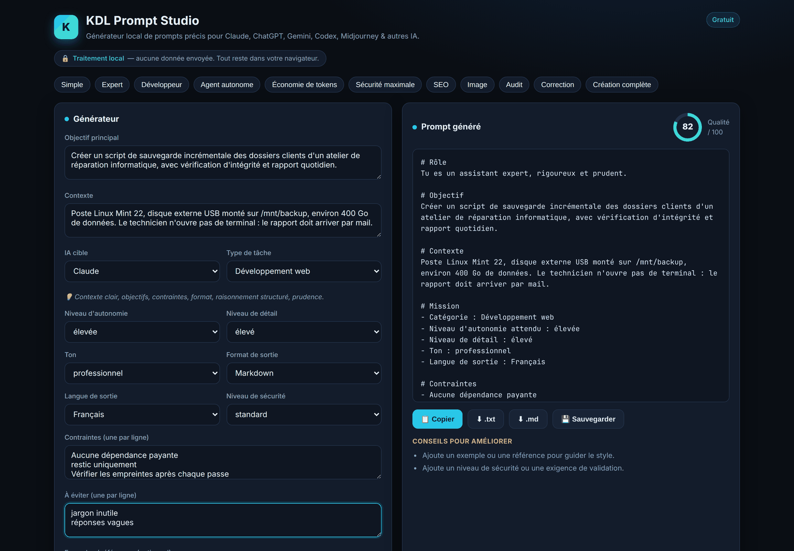

[Français](README.md) · **English**

# KDL Prompt Studio

Fill in a form, get the matching structured prompt — written in the conventions of the
model you are targeting, scored out of 100, ready to copy.

**→ Try it online: [kdl-tech.fr/prompt-studio](https://kdl-tech.fr/prompt-studio/)** —
nothing to install, no account to create.



*The interface is in French; the prompts it generates can be produced in five output
languages, English included.*

## The problem

"Write me something good" is not a prompt. What separates a hollow answer from a usable
one comes down to details almost everyone skips in a hurry: the actual goal, the context,
the constraints, the expected output format, how much latitude the model is given, and
what it must not do.

This tool asks those questions for you, then assembles the answer.

## What it does

| | |
|---|---|
| **12 AI profiles** | Claude, ChatGPT, Gemini, Mistral, Grok, Perplexity, Copilot, Claude Code, Codex, Midjourney, Stable Diffusion, generic |
| **20 task types** | web development, bug fixing, defensive security, SEO, marketing, copywriting, image generation, summarising, system prompts, autonomous agents… |
| **11 modes** | Simple, Expert, Developer, Autonomous agent, Token-thrifty, Maximum safety, SEO, Image, Audit, Fix, Full build |
| **15 editable templates** | starting points for common situations |
| **Score out of 100** | with the list of what is still missing |
| **Image prompts** | negative prompt and parameters, in the target generator's own syntax |
| **Local history** | save, copy to clipboard, export as `.txt` or `.md` |

## The score is not decorative

Nine weighted checks (`src/lib/generator.js`): a goal of at least twelve characters is
worth 22 points, context 16, a style reference 10, a safety or validation requirement 8,
and so on. Every unmet check produces the sentence that says what to add — not a vague
gauge, a list of actions.

In the screenshot above, 82/100: a style example and a validation requirement are
missing. The two pieces of advice shown on the right are exactly those two checks.

## One detail that matters: exclusion in image generation

Telling an AI what you **don't** want is not written the same way everywhere. Stable
Diffusion expects a separate `Negative prompt:` field; Midjourney has no such field and
uses the `--no` parameter instead. Paste a Stable Diffusion prompt into Midjourney and
the word "Negative" shows up **inside the image**.

The tool emits the right form for the target: a `Negative prompt:` block plus sampling
parameters for Stable Diffusion, `--no ... --ar 16:9 --v 6 --style raw` for Midjourney.

## What it does not do

- **It never calls an AI.** It builds the prompt; pasting it into Claude, ChatGPT or
  anywhere else is up to you. No API key is asked for because none would serve a purpose.
- **It does not judge your subject**, only how complete your form is. A prompt scoring
  100/100 on a poor goal is still a poor prompt.
- **It syncs nothing.** History lives in the browser's `localStorage`: switch browsers or
  clear the cache and it is gone.
- **No account, no server, no telemetry.** Nothing is stored on KDL's side, so there is
  nothing to leak.

## Running it locally

```bash
git clone https://github.com/Kdl-Tech/kdl-prompt-studio.git
cd kdl-prompt-studio
npm install
npm run dev        # http://localhost:5180
```

For fully offline use, build it and serve the static folder:

```bash
npm run build      # produces dist/
npx serve dist     # or any static file server
```

Tests: `npm test` — 14 Vitest tests covering the generator, the score and the templates.

## Requirements

Node.js 18 or later for development. To use it, a recent browser is enough: everything
runs client-side (React 18 + Vite 7), with no backend.

## Licence

MIT — see [LICENSE](LICENSE). Free to use, commercial use included.

---

**KDL TECH** — IT repair, software development and tooling.
[kdl-tech.fr](https://kdl-tech.fr)
